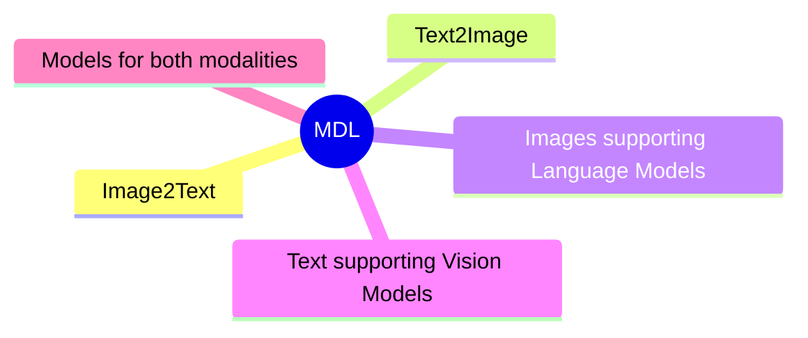
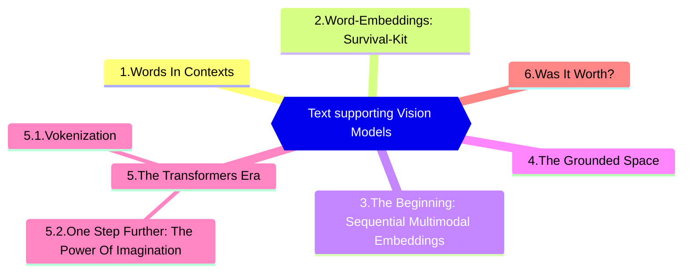

# Intro: Multimodal Deep Learning

From: ([LMU Munich, Germany](https://www.statistik.uni-muenchen.de/index.html))

## Research Direction

 
 

= 2">

Read more about [Multimodal Deep Learning](https://arxiv.org/abs/2301.04856)